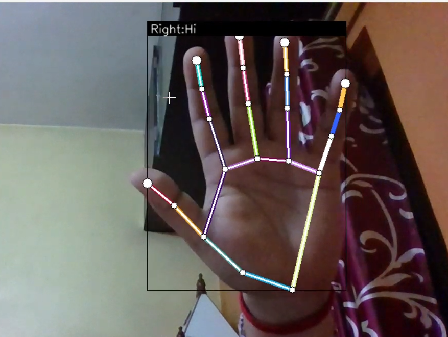

# Real-Time Custom Hand Gesture Recognition using OpenCV and MediaPipe

This project is a robust, real-time hand gesture recognition system built with **OpenCV** and **MediaPipe**, capable of detecting and classifying both static hand signs and dynamic finger gestures with high accuracy (**91% accuracy**). The system is customizable, allowing you to train your own gestures or modify existing ones using CSV-based data and Python scripts.

---

## Features

- **Real-time recognition**: Instantly detects and classifies hand signs and finger gestures from live video.
- **Customizable**: Add, modify, or retrain gestures via easy CSV data management and provided training scripts.
- **Modern computer vision**: Leverages advanced landmark detection (MediaPipe) and image processing (OpenCV).
- **Flexible models**: Supports both classic neural networks and LSTM-based models for dynamic gesture recognition.
- **Developer tools**: Utilities for data collection, confusion matrix visualization, and performance (FPS) monitoring.
- **Configurable runtime**: Options for camera device, image resolution, detection/tracking thresholds, and operation modes.

---

## Project Structure

---

## How It Works

1. **Hand landmark detection**: MediaPipe finds 21 hand keypoints per frame in real time.
2. **Feature extraction**: Extracts and normalizes landmark coordinates.
3. **Gesture classification**: TensorFlow Lite model predicts the gesture (static or dynamic).
4. **Retraining**: Add new samples and retrain the classifier using supplied notebooks.
5. **Monitoring**: Built-in FPS tracking and confusion matrix visualization for model evaluation.

---

## Model Training

- **Hand sign recognition**: Start keypoint logging (“k” mode), annotate samples (key “0”-“9”), data is saved to `keypoint.csv`.
- **Finger gesture recognition**: Start motion logging (“h” mode), annotate movement (“0”-“9”), data saved to `point_history.csv`.
- Training, exploration, and inference are performed using the project’s Jupyter notebooks.

---

## Example Model clip

---

## Requirements

- Python 3.6+
- OpenCV 3.4.2+
- MediaPipe 0.8.1+
- TensorFlow 2.3.0+  
- [Optional] tf-nightly for advanced LSTM models  
- [Optional] scikit-learn, matplotlib (for visualization)

Install required packages:
pip install opencv-python mediapipe tensorflow scikit-learn matplotlib

---

## Customization & Extensions

- Define new gestures or finger movements with new CSV samples.
- Update label files and retrain the model in the notebooks for your use case.
- TensorFlow Lite models ensure efficient real-time inference.

---

## License

Intended for personal and professional innovation. Please attribute if you use or share this work.

---

> This system is ideal for touchless interfaces, sign language tools, UX innovation, or computer vision R&D. Its accuracy and flexibility make it a great fit for next-gen applications!

